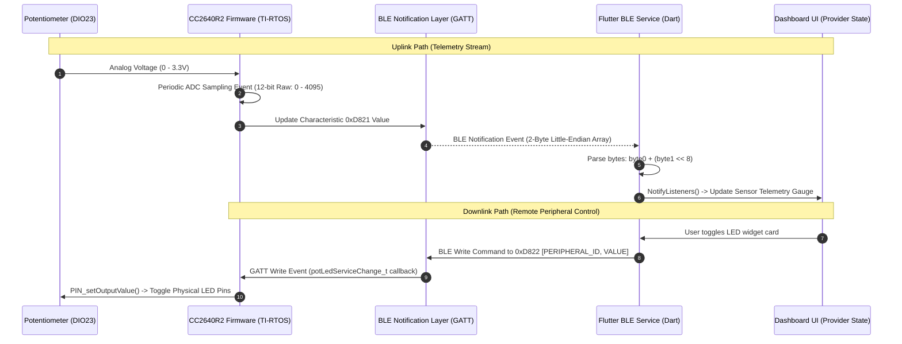

# IoT-Enabled Smart Household Monitoring and Control System
## Project Master Overview & Technical Documentation

---

### Table of Contents
1. [Project Introduction](#1-project-introduction)
2. [Project Objective](#2-project-objective)
3. [Hardware Stack](#3-hardware-stack)
4. [Firmware Architecture Overview](#4-firmware-architecture-overview)
5. [Flutter Application Architecture Overview](#5-flutter-application-architecture-overview)
6. [Current Progress Completed](#6-current-progress-completed)
7. [Engineering Challenges Solved](#7-engineering-challenges-solved)
8. [Future Roadmap](#8-future-roadmap)
9. [System Architecture Flow Diagram](#9-system-architecture-flow-diagram)
10. [Version History](#10-version-history)

---

### 1. Project Introduction
This project is an **embedded IoT monitoring and control system** built around low-energy, low-latency communication. Utilizing **Bluetooth Low Energy (BLE)**, the system forms a bridge between a local sensor-actuator node (powered by Texas Instruments silicon) and a mobile central controller. 

The physical hardware reads analog telemetry (such as pot-derived voltage levels) via an onboard Analog-to-Digital Converter (ADC) and propagates changes to a mobile application client via asynchronous BLE notifications. Concurrently, the mobile controller writes command structures to toggle physical peripherals (such as LEDs) on the hardware, establishing a full-duplex, real-time control interface for modern smart-home ecosystems.

---

### 2. Project Objective
*   **Real-Time Sensor Monitoring through BLE:** Establish high-telemetry-rate, low-latency delivery of analog sensor values (0–3.3V mapped to a 12-bit digital space) using BLE notification streams, minimizing transmission overhead.
*   **Remote Peripheral Control through Mobile Application:** Provide direct, responsive control over the physical state of the hardware (e.g., LED actuators) using write-command frames initiated by the user interface.
*   **Smart Household Automation Foundation:** Design a modular and scalable firmware/software profile schema that can be easily extended to multi-node configurations, sensor expansions (touch, temperature), and high-voltage relay triggers.

---

### 3. Hardware Stack

| Component | Role in Project | Technical Specification / Configuration |
| :--- | :--- | :--- |
| **TI CC2640R2 LaunchPad** | Core MCU Evaluation & Prototyping Platform | ARM Cortex-M3 (48 MHz), 128KB Flash, 20KB SRAM. Runs the BLE5 Stack and TI-RTOS. |
| **Custom CC2640R2F Board** | Future Production Expansion Platform | Custom PCB breakout incorporating the CC2640R2F microcontroller chip for optimized footprint and power efficiency. |
| **10k Potentiometer** | Analog Sensor Input Simulator | Three-pin linear taper potentiometer. Wiper output simulates physical sensor voltage variance (0V to 3.3V). |
| **Breadboard & Jumper Wires** | Rapid Prototyping Interconnect | Used to wire the potentiometer to the LaunchPad's BoosterPack header pins without soldering. |
| **Android Mobile Device** | BLE Central Client Node | Runs the dashboard application, handling service discovery, CCCD configuration, and UI rendering. |
| **Flutter Mobile Application** | Graphical Console & State Controller | Custom-built application using Dart, Provider state management, and BLE service abstractions. |

#### Physical Pin Configuration (CC2640R2 LaunchPad)
*   **VCC (Potentiometer Pin 1):** Connected to LaunchPad `3.3V` (J1.1 BoosterPack Header)
*   **GND (Potentiometer Pin 3):** Connected to LaunchPad `GND` (J1.2 / J2.20 BoosterPack Header)
*   **Signal Wiper (Potentiometer Pin 2):** Connected to LaunchPad `DIO23` (J1.4, mapped as `Board_ADC0`)

---

### 4. Firmware Architecture Overview

The CC2640R2 LaunchPad firmware is built on the **TI SimpleLink SDK (v1.40.00.45+)** and leverages the **TI-RTOS (Real-Time Operating System)** environment. It is structured around the `simple_peripheral` project baseline and integrates a custom GATT profile.

```
       +---------------------------------------------+
       |                  TI-RTOS                    |
       |  +---------------------------------------+  |
       |  |          simple_peripheral.c          |  |
       |  |  (Main Application Event Loop / Tasks) |  |
       |  +-------------------+-------------------+  |
       |                      |                      |
       |       +--------------+--------------+       |
       |       |                             |       |
       |       v                             v       |
+------+---------------+             +-------+-------+
|  pot_led_service.c   |             |  ADC & GPIO   |
| (Custom GATT Profile)|             |    Drivers    |
+----------------------+             +---------------+
```

*   **BLE5 Stack based Simple Peripheral:** Operates as a BLE Peripheral device, broadcasting advertising frames (`GAPRole` state machine) to allow discovery and connection by the Flutter client.
*   **Custom GATT Service Implementation (`pot_led_service`)**:
    *   **Service UUID:** `48c5d820-ac2a-11e7-abc4-cec278b6b50a` (Short ID: `0xD820`)
    *   **Characteristic 1 (ADC / Voltage):** UUID `48c5d821-ac2a-11e7-abc4-cec278b6b50a` (Short ID: `0xD821`). Permissions: **Read & Notify**. Format: 2-byte unsigned integer (`uint16_t`) representing raw ADC counts (0–4095).
    *   **Characteristic 2 (LED State):** UUID `48c5d822-ac2a-11e7-abc4-cec278b6b50a` (Short ID: `0xD822`). Permissions: **Read & Write**. Format: 2-byte array `[PERIPHERAL_ID, VALUE]` to support multi-peripheral switching logic.
*   **ADC Subsystem:** Uses the TI-RTOS ADC driver. `Board_ADC0` is bound to physical pin `DIO23`. Configured with standard hardware attributes (`adcCC26XXHWAttrs`) in board file overrides:
    *   *Reference Source:* `ADC_COMPB_REF_VDDS_REL` (Relative to supply VDDS)
    *   *Sampling Mode:* Single-channel blocking reads within a periodic event frame.
*   **GPIO Subsystem:** Operates TI PIN/GPIO drivers to change the logic level of the board's Red/Green LEDs based on the incoming command packet written to the LED Characteristic.
*   **RTOS Event Architecture:** Built using TI-RTOS software timers (`Clock_Handle`) and event flags. Periodic timers trigger an application task event (`SP_PERIODIC_ADC_EVT`), executing an ADC sample cycle and queueing GATT updates without blocking the BLE stack execution.
*   **BLE Notifications:** Supports asynchronous push updates. When the Client Characteristic Configuration Descriptor (CCCD) for `0xD821` is written with `0x0001` (notifications enabled) by the Flutter client, changes in ADC voltage are automatically pushed to the client using `GATT_Notification()`.

---

### 5. Flutter Application Architecture Overview

The mobile application is structured around clean architecture guidelines, decoupling physical hardware communication from state presentation using state managers and hardware abstraction layers.

```
+-------------------------------------------------------------+
|                          FLUTTER UI                         |
|   DashboardScreen  <---------->  Widgets (DeviceCard, etc.) |
+------------------------------+------------------------------+
                               | (Consumes State)
                               v
+-------------------------------------------------------------+
|                         STATE LAYER                         |
|   DeviceProvider  |  ConnectionProvider  |  ThemeProvider   |
+------------------------------+------------------------------+
                               | (Notifies / Updates)
                               v
+-------------------------------------------------------------+
|                      ABSTRACTION LAYER                      |
|                       BleManager Service                    |
+------------------------------+------------------------------+
                               | (Interfaces with)
                               v
+-------------------------------------------------------------+
|                    PHYSICAL COMMUNICATIONS                  |
|          MockBleService / Real BLE (GATT Interface)         |
+-------------------------------------------------------------+
```

*   **Provider State Management:** Utilizes the `Provider` library to distribute reactive states across the widget tree. 
    *   `DeviceProvider` holds active maps of `SmartDevice` models and manages capabilities updates.
    *   `ConnectionProvider` manages scanning, active connection counters, and connection states.
    *   `ThemeProvider` handles modern user preferences (light/dark mode toggle).
*   **BLE Manager Abstraction Layer (`BleManager`):** Acts as the controller for the BLE lifecycle. It handles scanner initialization, connection sequences, and maps raw incoming byte streams to parsed data objects. It supports switching transparently to a local simulation provider (`MockBleService`) for off-hardware application testing.
*   **Theme Architecture:** Built using customized modern visual assets. Implements neon/glassmorphism design cues, consistent typography scaling, and high-contrast color indicators suited for smart home monitoring controls.
*   **Dashboard Architecture (`DashboardScreen`):** Responsive grid/list dashboard that displays the smart network nodes. Includes:
    *   Connection status indicators.
    *   Analog telemetry metrics displaying real-time voltage and battery values.
    *   Actionable card controls (`DeviceCard`) matching specific capabilities.
*   **Device State Management:** Models the BLE node using the `SmartDevice` blueprint. Each device maintains a dictionary of `DeviceCapability` modules (`voltage`, `touch`, `battery`, `temperature`, `rgbLed`, `relay`), permitting granular updates to single parameters (e.g., updating voltage on characteristic write event) without tearing down the entire model.

---

### 6. Current Progress Completed

*   `[x]` **BLE Advertising Working:** LaunchPad correctly advertises as `Simple Peripheral` and is discoverable by mobile central clients.
*   `[x]` **ADC Sampling Working:** 12-bit ADC converts analog voltage inputs on physical pin `DIO23` correctly.
*   `[x]` **BLE Notifications Working:** Client subscriptions to Characteristic `0xD821` successfully push real-time ADC samples.
*   `[x]` **LED Control Working:** Sending a 2-byte write command sequence to Characteristic `0xD822` toggles the onboard GPIO LEDs.
*   `[x]` **Flutter Architecture Completed:** Established full service, state (Provider), and model abstraction paths (`SmartDevice`, `DeviceCapability`, `CapabilityType`).
*   `[x]` **UI Redesign in Progress:** Modernizing dashboard components to represent telemetry with rich aesthetics.

---

### 7. Engineering Challenges Solved

*   **BLE Characteristic Architecture:** Solved the challenge of defining a clean service layout representing both physical telemetry and control operations. Settled on a custom 128-bit UUID scheme (`0xD820` Service) containing a dedicated notification characteristic (`0xD821` for ADC) and a write-enabled command characteristic (`0xD822` for LED state).
*   **ADC Driver Integration:** Integrated the low-level TI ADC driver within the thread-safe context of TI-RTOS, avoiding conflicts with high-priority RF Core activities. Resolved pin mapping details in the board header (`CC2640R2_LAUNCHXL.c` / `CC2640R2_LAUNCHXL.h`) to assign `DIO23` to `Board_ADC0`.
*   **RTOS Periodic Clock Event System:** Constructed an independent, non-blocking software clock (`Clock_Handle`) linked to the Simple Peripheral task event loop. This prevents the blocking ADC reads from starving the core Bluetooth protocol stack operations.
*   **Custom GATT Service Creation:** Resolved compilation issues within the Code Composer Studio compilation chain when integrating external profile source files (`pot_led_service.c`/`.h`). Successfully wired the callback registration (`PotLedService_RegisterAppCBs`) to handle incoming GATT write requests directly in the application layer task callback.
*   **Little-Endian BLE Data Interpretation:** Addressed data representation mismatches. The CC2640R2 ARM microcontroller encodes multi-byte numbers in little-endian format (low byte first). Solved this by parsing bytes on the client-side using bitwise reconstruction:
    $$\text{Value} = \text{Byte}_0 + (\text{Byte}_1 \ll 8)$$
    This ensures raw 12-bit ADC read accuracies are perfectly preserved over the air.

---

### 8. Future Roadmap

```
+--------------------------------------------------------------------------------+
| SHORT TERM                                                                     |
| - Dual board BLE communication (inter-board synchronization)                   |
| - Additional peripheral monitoring (multiplexing analog inputs)                 |
+--------------------------------------------------------------------------------+
                                       |
                                       v
+--------------------------------------------------------------------------------+
| MID TERM                                                                       |
| - Sensor expansion (Integrate physical touch, temperature, and ambient sensors) |
| - Relay control (High-voltage mains switching via transistor-buffered GPIO)    |
| - Appliance automation (Rules engine: triggering relay states via ADC limits)  |
+--------------------------------------------------------------------------------+
                                       |
                                       v
+--------------------------------------------------------------------------------+
| LONG TERM                                                                      |
| - Multi-node BLE network (Star network controlled by a single central node)   |
| - Distributed smart home monitoring system (Gateway bridge: BLE-to-MQTT/Wi-Fi) |
+--------------------------------------------------------------------------------+
```

---

### 9. System Architecture Flow Diagram

The following diagram traces the system's data stream loop. Telemetry is gathered from the physical sensor, processed in firmware, notified over the air, parsed by the app, and rendered on the UI dashboard. Actions taken on the dashboard are transmitted down the BLE control path to actuate LEDs.



---

### 10. Version History

| Version | Date | Status / Author | Description |
| :---: | :---: | :---: | :--- |
| **v0.1** | 2026-07-02 | Initial Baseline / Engineering Team | Project initialization. BLE advertising and custom service parameters initialized. |
| **v0.5** | 2026-07-02 | Firmware Completed / App In Progress | **Firmware backend completed:** ADC periodic sampling, custom GATT callbacks, and LED toggle controls verified on CC2640R2 LaunchPad hardware. **Flutter frontend under development:** Model structures, providers, and mock abstraction layers completed; UI dashboard redesign in progress. |
